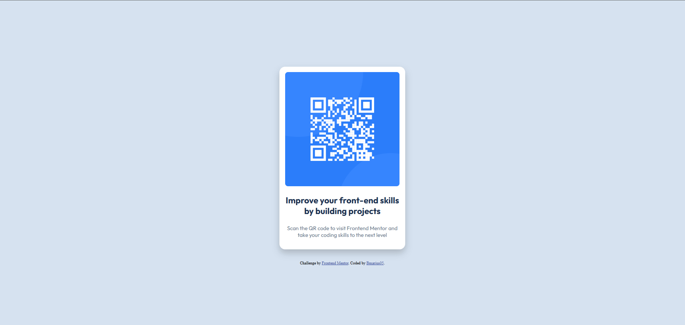

# Frontend Mentor - QR code component solution

This is a solution to the [QR code component challenge on Frontend Mentor](https://www.frontendmentor.io/challenges/qr-code-component-iux_sIO_H). Frontend Mentor challenges help you improve your coding skills by building realistic projects. 

## Table of contents

- [Overview](#overview)
  - [Screenshot](#screenshot)
  - [Links](#links)
- [My process](#my-process)
  - [Built with](#built-with)
  - [What I learned](#what-i-learned)
  - [Continued development](#continued-development)
- [Author](#author)


## Overview


### Screenshot



### Links

- Solution URL: [Add solution URL here](https://github.com/bmarius05/FrontendMentorQR
- Live Site URL: [Add live site URL here](https://bmarius05.github.io/FrontendMentorQR/)

## My process
I started by outlining the components. I separated them using appropriated HTML tags. I styled the components using CSS.


### Built with

- Semantic HTML5 markup
- CSS custom properties

### What I learned
Using css flex


```css
.card{
    overflow: hidden;
    justify-content: center;
    align-items: center;
    display: flex;
    flex-direction: column;
    background-color: white;
    height: 30rem;
    width: 20rem;
    border-radius: 1rem;
    box-shadow: 0 10px 20px rgba(0, 0, 0, 0.2);
    margin-bottom: 2rem;
    padding: 1rem;
}
```

### Continued development

Would love to improve designs.

## Author

- Frontend Mentor - [@bmarius05](https://www.frontendmentor.io/profile/bmarius05)
- Twitter - [@Marius0518](https://x.com/Marius0518)


